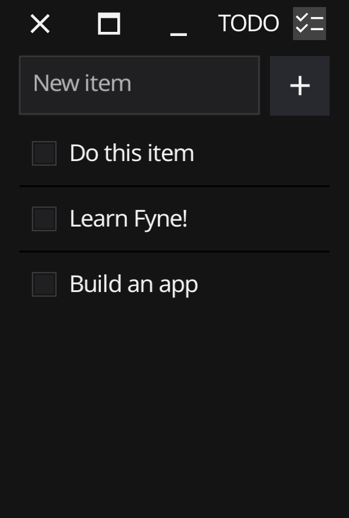

# TODO App

> Published in Linux Magazine 273, August 2023

This code accompanies the "GUI Apps with Fyne" In-Depth article in August 2023.
You can get a copy at [linux-magazine.com](https://www.linux-magazine.com/Issues/2023/273).

The code in this repository creates a fully working TODO list app that uses
local storage through the Fyne Preferences API to store information.

The app will compile and run on Linux, macOS, Windows, BSDs, Android and iOS.

